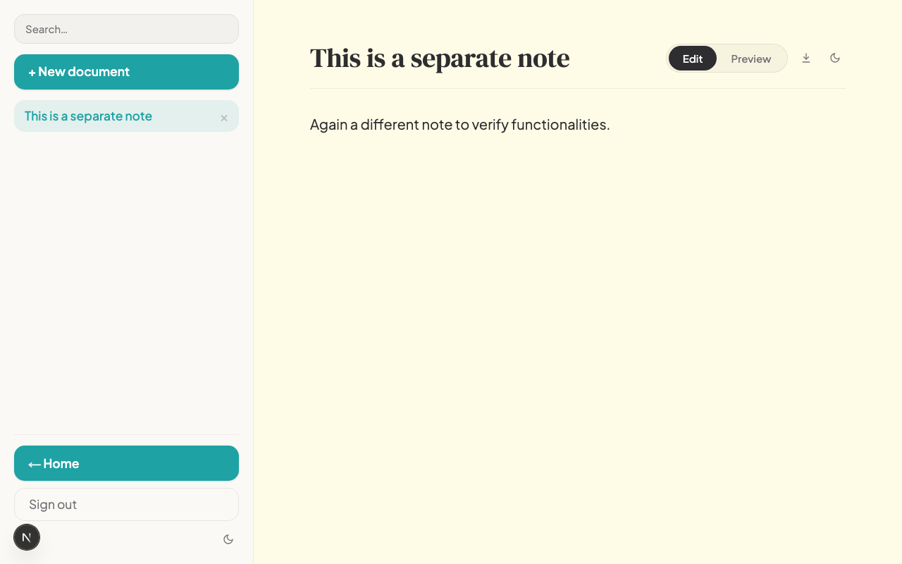

# Notes Workspace

A private, persistent notes app built with Next.js 16 (App Router), React 19, and Supabase. Users sign in with email and password and see only their own notes — Row-Level Security enforces isolation at the database level so no account can access another's data.

## What it does

- Create, edit, and delete notes that persist in Supabase across page reloads
- Per-user data isolation — each note row carries a `user_id` tied to the signed-in user; RLS enforces this at the database level
- Markdown preview — render headings, bold, italic, and bullet lists from the body field with an Edit/Preview toggle
- Export any note as a `.md` file via the download button in the editor header
- Dark/light mode toggle with no flash on first load (theme stored in a cookie, applied server-side)
- Responsive layout — collapsible sidebar overlay on mobile, two-pane editor on desktop
- Self-service sign-up at `/auth/sign-up` so new users can register without a manual step in the Supabase dashboard

## Running locally

### 1. Clone and install

```bash
git clone https://github.com/TuringCollegeSubmissions/sipanin-BAI.2.8
cd sipanin-BAI.2.8
npm install
```

### 2. Set environment variables

Create a `.env.local` file in the project root:

```env
NEXT_PUBLIC_SUPABASE_URL=your-project-url
NEXT_PUBLIC_SUPABASE_PUBLISHABLE_KEY=your-anon-key
```

**Where to find the values**

1. Open the [Supabase dashboard](https://supabase.com/dashboard) and select your project.
2. Go to **Project Settings → API**.
3. **Project URL** → paste as `NEXT_PUBLIC_SUPABASE_URL`.
4. **Project API keys → `anon` `public`** → paste as `NEXT_PUBLIC_SUPABASE_PUBLISHABLE_KEY`.

> The service-role key is not used by this app and must never go into `.env.local`.

### 3. Start the dev server

```bash
npm run dev
```

The app runs at [http://localhost:3000](http://localhost:3000).

## Screenshot



## Optional tasks delivered

### Export to Markdown — [PR #2](https://github.com/TuringCollegeSubmissions/sipanin-BAI.2.8/pull/2)

**Branch:** `markdown-export`

Adds a download button (download icon) to each note's editor header. Clicking it exports the note's title and body as a `.md` file using the browser's built-in `Blob` + `URL.createObjectURL` API — no new dependency required.

### Self-service sign-up — [PR #3](https://github.com/TuringCollegeSubmissions/sipanin-BAI.2.8/pull/3)

**Branch:** `sign-up-auth-flow`

Adds a `/auth/sign-up` page so new users can register without needing a manual entry in the Supabase Authentication tab. Cross-linked with the sign-in page. Uses Supabase's default `signUp()` flow; email input is trimmed before the auth call to prevent whitespace-related failures.
